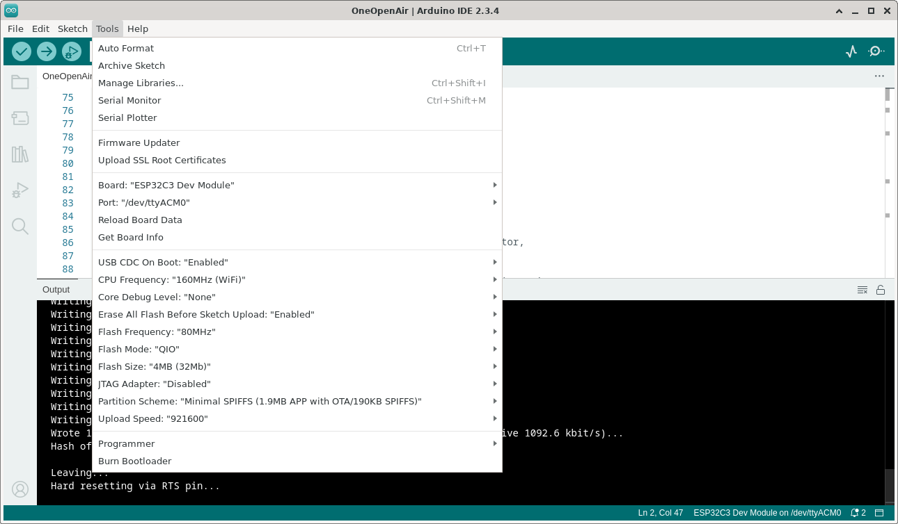
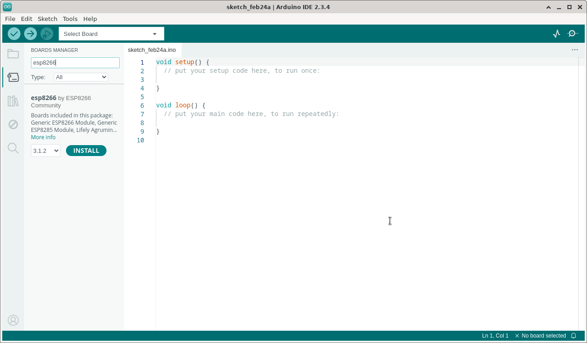

# How to compile AirGradient firmware on Arduino IDE

## Prequisite

Arduino IDE version 2.x

## Steps for ESP32C3 based board (ONE and Open Air Model)

1. Install esp32 board on board manager with version **2.0.17**


2. Install AirGradient library on library manager using the latest version (at the time of writing, its 3.2.0)


3. On tools tab, follow settings below

```
Board ➝ ESP32C3 Dev Module
USB CDC On Boot ➝ Enabled
CPU Frequency ➝ 160MHz (WiFi)
Core Debug Level ➝ None (or choose as needed)
Erase All Flash Before Sketch Upload ➝ Enabled (or choose as needed)
Flash Frequency ➝ 80MHz
Flash Mode ➝ QIO
Flash Size ➝ 4MB
JTAG Adapter ➝ Disabled
Partition Scheme ➝ Minimal SPIFFS (1.9MB APP with OTA/190KB SPIFFS)
Upload Speed ➝ 921600
```



4. Compile

## Steps for ESP8266 based board (DIY model)

1. Add esp8266 board by adding http://arduino.esp8266.com/stable/package_esp8266com_index.json into Additional Board Manager URLs field.
2. Install esp8266 board on board manage with version **3.1.2**



3. Set board to `LOLIN(WEMOS) D1 R2 & mini`, let other settings to default
4. Compile

## Possible Issues

### Linux (Debian)

ModuleNotFoundError: No module named ‘serial’

Make sure python pyserial module installed globally in the environment by executing: 

`$ pip install pyserial`